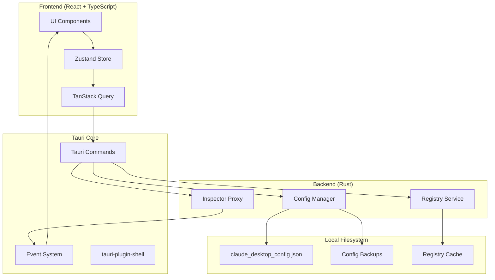
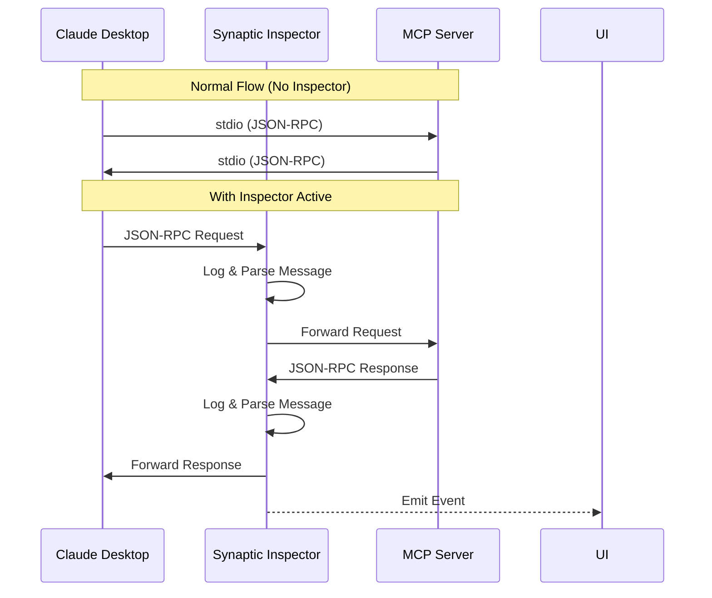

# Synaptic - Architecture Document

> **The "Docker Desktop" for Model Context Protocol (MCP)**

## 1. Executive Summary

Synaptic is a cross-platform desktop application that simplifies the management of MCP (Model Context Protocol) servers. It eliminates the need for manual JSON configuration editing by providing a visual interface to install, configure, and debug MCP servers.

### Core Value Proposition
- **Zero-config installation**: One-click server installation from a curated registry
- **Visual configuration**: GUI-based server management (no JSON editing)
- **Real-time debugging**: Inspect JSON-RPC traffic between clients and servers

---

## 2. Technology Stack

| Layer | Technology | Rationale |
|-------|-----------|-----------|
| **Desktop Framework** | Tauri v2 (Beta/RC) | Minimal resource footprint (~10MB vs Electron's 100MB+) |
| **Backend** | Rust | Memory safety, performance, native OS integration |
| **Frontend** | React + TypeScript + Vite | Fast DX, type safety, ecosystem maturity |
| **Styling** | TailwindCSS + Shadcn/UI | Rapid prototyping, consistent design system |
| **State Management** | Zustand | Lightweight, minimal boilerplate |
| **Serialization** | serde + serde_json | De-facto Rust JSON handling |
| **Async Runtime** | Tokio | Industry-standard async runtime |

---

## 3. System Architecture



---

## 4. Data Models (Rust Structs)

### 4.1 MCP Configuration Schema

```rust
use serde::{Deserialize, Serialize};
use std::collections::HashMap;

/// Root configuration structure matching Claude Desktop's config format
#[derive(Debug, Clone, Serialize, Deserialize, Default)]
#[serde(rename_all = "camelCase")]
pub struct McpConfig {
    /// Map of server name to server configuration
    #[serde(default)]
    pub mcp_servers: HashMap<String, McpServer>,
    
    /// Preserve any unknown fields for forward compatibility
    #[serde(flatten)]
    pub extra: HashMap<String, serde_json::Value>,
}

/// Individual MCP server configuration
#[derive(Debug, Clone, Serialize, Deserialize)]
#[serde(rename_all = "camelCase")]
pub struct McpServer {
    /// Command to execute (e.g., "npx", "uvx", "node")
    pub command: String,
    
    /// Arguments passed to the command
    #[serde(default)]
    pub args: Vec<String>,
    
    /// Environment variables for the server process
    #[serde(default)]
    pub env: HashMap<String, String>,
    
    /// Optional working directory
    #[serde(skip_serializing_if = "Option::is_none")]
    pub cwd: Option<String>,
    
    /// Server enabled/disabled state (Synaptic extension)
    #[serde(default = "default_true")]
    pub enabled: bool,
}

fn default_true() -> bool {
    true
}

/// Server entry from the registry (for installation)
#[derive(Debug, Clone, Serialize, Deserialize)]
pub struct RegistryServer {
    /// Unique identifier
    pub id: String,
    
    /// Human-readable name
    pub name: String,
    
    /// Description of functionality
    pub description: String,
    
    /// Icon URL or embedded base64
    pub icon: Option<String>,
    
    /// Installation method
    pub install_method: InstallMethod,
    
    /// Default configuration template
    pub default_config: McpServer,
    
    /// Repository URL for source
    pub repo_url: Option<String>,
    
    /// Tags for categorization
    pub tags: Vec<String>,
}

/// Installation method for registry servers
#[derive(Debug, Clone, Serialize, Deserialize)]
#[serde(tag = "type", rename_all = "snake_case")]
pub enum InstallMethod {
    /// Run via npx (Node.js)
    Npx { package: String },
    
    /// Run via uvx (Python/uv)
    Uvx { package: String },
    
    /// Clone from git repository
    GitClone { url: String, build_command: Option<String> },
    
    /// Direct binary download
    Binary { url: String },
}
```

### 4.2 Inspector Data Models

```rust
use chrono::{DateTime, Utc};
use serde::{Deserialize, Serialize};

/// Direction of JSON-RPC message
#[derive(Debug, Clone, Serialize, Deserialize, PartialEq)]
#[serde(rename_all = "lowercase")]
pub enum MessageDirection {
    Request,   // Client -> Server
    Response,  // Server -> Client
}

/// Captured JSON-RPC message for the inspector
#[derive(Debug, Clone, Serialize, Deserialize)]
pub struct InspectorMessage {
    /// Unique message ID
    pub id: String,
    
    /// Timestamp of capture
    pub timestamp: DateTime<Utc>,
    
    /// Direction of message flow
    pub direction: MessageDirection,
    
    /// Server name this message belongs to
    pub server_name: String,
    
    /// Raw JSON-RPC payload
    pub payload: serde_json::Value,
    
    /// Parsed method name (if request)
    pub method: Option<String>,
    
    /// Duration in milliseconds (for responses matched to requests)
    pub duration_ms: Option<u64>,
}

/// Inspector session state
#[derive(Debug, Clone, Serialize, Deserialize)]
pub struct InspectorSession {
    pub server_name: String,
    pub started_at: DateTime<Utc>,
    pub messages: Vec<InspectorMessage>,
    pub is_active: bool,
}
```

---

## 5. Tauri Commands API

### 5.1 Config Manager Commands

```rust
// ============================================
// CONFIG MANAGER COMMANDS
// ============================================

/// Get the OS-specific path to Claude Desktop config
#[tauri::command]
async fn get_config_path() -> Result<String, String>;

/// Read and parse the current MCP configuration
#[tauri::command]
async fn read_config() -> Result<McpConfig, String>;

/// Write configuration with automatic backup
#[tauri::command]
async fn write_config(config: McpConfig) -> Result<(), String>;

/// Add a new MCP server to the configuration
#[tauri::command]
async fn add_server(name: String, server: McpServer) -> Result<(), String>;

/// Remove an MCP server from the configuration
#[tauri::command]
async fn remove_server(name: String) -> Result<(), String>;

/// Update an existing MCP server configuration
#[tauri::command]
async fn update_server(name: String, server: McpServer) -> Result<(), String>;

/// Toggle server enabled/disabled state
#[tauri::command]
async fn toggle_server(name: String, enabled: bool) -> Result<(), String>;

/// List all configuration backups
#[tauri::command]
async fn list_backups() -> Result<Vec<BackupInfo>, String>;

/// Restore configuration from a backup
#[tauri::command]
async fn restore_backup(backup_id: String) -> Result<(), String>;
```

### 5.2 Inspector Commands

```rust
// ============================================
// INSPECTOR COMMANDS
// ============================================

/// Start the inspector proxy for a server
#[tauri::command]
async fn start_inspector(
    app: AppHandle,
    server_name: String
) -> Result<InspectorSession, String>;

/// Stop the inspector for a server
#[tauri::command]
async fn stop_inspector(server_name: String) -> Result<(), String>;

/// Get captured messages for a server
#[tauri::command]
async fn get_inspector_messages(
    server_name: String,
    limit: Option<usize>,
    offset: Option<usize>
) -> Result<Vec<InspectorMessage>, String>;

/// Clear inspector message history
#[tauri::command]
async fn clear_inspector_messages(server_name: String) -> Result<(), String>;

// Event: "inspector:message" - Emitted when new message captured
// Payload: InspectorMessage
```

### 5.3 Registry Commands

```rust
// ============================================
// REGISTRY COMMANDS
// ============================================

/// Get list of available servers from registry
#[tauri::command]
async fn get_registry_servers() -> Result<Vec<RegistryServer>, String>;

/// Install a server from the registry
#[tauri::command]
async fn install_registry_server(
    server_id: String,
    custom_name: Option<String>
) -> Result<(), String>;

/// Check if required runtime is available (node, python, etc.)
#[tauri::command]
async fn check_runtime(runtime: String) -> Result<RuntimeStatus, String>;
```

---

## 6. Frontend Architecture

### 6.1 Component Hierarchy

```
src/
├── App.tsx                    # Root component with routing
├── components/
│   ├── layout/
│   │   ├── Sidebar.tsx        # Navigation sidebar
│   │   ├── Header.tsx         # Top header with actions
│   │   └── MainLayout.tsx     # Layout wrapper
│   ├── servers/
│   │   ├── ServerList.tsx     # Dashboard server grid/list
│   │   ├── ServerCard.tsx     # Individual server card
│   │   ├── ServerForm.tsx     # Add/Edit server modal
│   │   └── ServerActions.tsx  # Quick action buttons
│   ├── inspector/
│   │   ├── InspectorPanel.tsx # Main inspector view
│   │   ├── MessageLog.tsx     # Real-time message list
│   │   ├── MessageDetail.tsx  # JSON-RPC message viewer
│   │   └── FilterBar.tsx      # Message filtering controls
│   ├── registry/
│   │   ├── RegistryBrowser.tsx # Server catalog view
│   │   ├── RegistryCard.tsx    # Installable server card
│   │   └── InstallDialog.tsx   # Installation modal
│   └── ui/                    # Shadcn/UI components
├── hooks/
│   ├── useConfig.ts           # Config CRUD operations
│   ├── useInspector.ts        # Inspector state & events
│   └── useRegistry.ts         # Registry queries
├── stores/
│   └── appStore.ts            # Zustand global store
├── lib/
│   ├── tauri.ts               # Tauri command wrappers
│   └── utils.ts               # Utility functions
└── types/
    └── index.ts               # TypeScript interfaces
```

### 6.2 Zustand Store Structure

```typescript
interface AppState {
  // UI State
  sidebarOpen: boolean;
  activeView: 'servers' | 'inspector' | 'registry' | 'settings';
  
  // Server State
  servers: Record<string, McpServer>;
  selectedServer: string | null;
  
  // Inspector State
  inspectorActive: boolean;
  inspectorMessages: InspectorMessage[];
  
  // Actions
  setSidebarOpen: (open: boolean) => void;
  setActiveView: (view: AppState['activeView']) => void;
  setServers: (servers: Record<string, McpServer>) => void;
  selectServer: (name: string | null) => void;
  addInspectorMessage: (message: InspectorMessage) => void;
  clearInspectorMessages: () => void;
}
```

### 6.3 TanStack Query Keys

```typescript
export const queryKeys = {
  config: ['config'] as const,
  servers: ['servers'] as const,
  server: (name: string) => ['servers', name] as const,
  backups: ['backups'] as const,
  registry: ['registry'] as const,
  registryServer: (id: string) => ['registry', id] as const,
  runtimeStatus: (runtime: string) => ['runtime', runtime] as const,
};
```

---

## 7. Inspector Architecture

### 7.1 Proxy Design

The Inspector uses a **man-in-the-middle (MITM) proxy** approach to capture JSON-RPC traffic:



### 7.2 Implementation Strategy

```rust
/// Inspector proxy that wraps an MCP server process
pub struct InspectorProxy {
    server_name: String,
    child_process: Child,
    stdin_tx: mpsc::Sender<String>,
    stdout_rx: mpsc::Receiver<String>,
    message_buffer: Vec<InspectorMessage>,
}

impl InspectorProxy {
    /// Spawn the MCP server and set up stdio proxying
    pub async fn spawn(
        config: &McpServer,
        app_handle: AppHandle,
    ) -> Result<Self, InspectorError>;
    
    /// Forward a message to the server and capture it
    pub async fn send(&mut self, message: &str) -> Result<(), InspectorError>;
    
    /// Read response from server and capture it
    pub async fn recv(&mut self) -> Result<String, InspectorError>;
}
```

---

## 8. File System Paths

### 8.1 Claude Desktop Config Locations

| OS | Path |
|----|------|
| **macOS** | `~/Library/Application Support/Claude/claude_desktop_config.json` |
| **Windows** | `%APPDATA%\Claude\claude_desktop_config.json` |
| **Linux** | `~/.config/Claude/claude_desktop_config.json` |

### 8.2 Synaptic Data Locations

| OS | Path |
|----|------|
| **macOS** | `~/Library/Application Support/Synaptic/` |
| **Windows** | `%APPDATA%\Synaptic\` |
| **Linux** | `~/.config/Synaptic/` |

**Directory Structure:**
```
Synaptic/
├── backups/                    # Config backups with timestamps
│   ├── 2024-01-15T10-30-00.json
│   └── 2024-01-16T14-22-00.json
├── registry_cache.json         # Cached registry data
└── settings.json               # Synaptic app settings
```

---

## 9. Registry (MVP - Hardcoded)

### 9.1 Initial Server List

```rust
pub fn get_builtin_registry() -> Vec<RegistryServer> {
    vec![
        RegistryServer {
            id: "filesystem".into(),
            name: "Filesystem".into(),
            description: "Read/write access to local filesystem".into(),
            icon: None,
            install_method: InstallMethod::Npx {
                package: "@anthropic-ai/mcp-server-filesystem".into(),
            },
            default_config: McpServer {
                command: "npx".into(),
                args: vec![
                    "-y".into(),
                    "@anthropic-ai/mcp-server-filesystem".into(),
                    "/path/to/allowed/directory".into(),
                ],
                env: HashMap::new(),
                cwd: None,
                enabled: true,
            },
            repo_url: Some("https://github.com/anthropics/mcp-servers".into()),
            tags: vec!["filesystem".into(), "official".into()],
        },
        RegistryServer {
            id: "sqlite".into(),
            name: "SQLite".into(),
            description: "Query and manage SQLite databases".into(),
            icon: None,
            install_method: InstallMethod::Uvx {
                package: "mcp-server-sqlite".into(),
            },
            default_config: McpServer {
                command: "uvx".into(),
                args: vec![
                    "mcp-server-sqlite".into(),
                    "--db-path".into(),
                    "/path/to/database.db".into(),
                ],
                env: HashMap::new(),
                cwd: None,
                enabled: true,
            },
            repo_url: Some("https://github.com/anthropics/mcp-servers".into()),
            tags: vec!["database".into(), "sql".into(), "official".into()],
        },
        RegistryServer {
            id: "github".into(),
            name: "GitHub".into(),
            description: "Interact with GitHub repositories".into(),
            icon: None,
            install_method: InstallMethod::Npx {
                package: "@anthropic-ai/mcp-server-github".into(),
            },
            default_config: McpServer {
                command: "npx".into(),
                args: vec![
                    "-y".into(),
                    "@anthropic-ai/mcp-server-github".into(),
                ],
                env: HashMap::from([
                    ("GITHUB_TOKEN".into(), "<your-token>".into()),
                ]),
                cwd: None,
                enabled: true,
            },
            repo_url: Some("https://github.com/anthropics/mcp-servers".into()),
            tags: vec!["git".into(), "vcs".into(), "official".into()],
        },
        // Add more servers as needed...
    ]
}
```

---

## 10. Security Considerations

1. **Config File Access**: Only read/write to user-owned directories
2. **Process Spawning**: Validate commands before execution
3. **Environment Variables**: Mask sensitive values (tokens, keys) in UI
4. **Backup Encryption**: Optional encryption for backups containing secrets
5. **Inspector Data**: In-memory only, not persisted to disk by default

---

## 11. MVP Scope Boundaries

### ✅ In Scope (Phase 1)
- Read/write Claude Desktop config
- Add/remove/edit MCP servers via GUI
- Automatic backup before changes
- Basic Inspector with real-time log
- Hardcoded registry with ~5 servers
- Cross-platform support (macOS, Windows, Linux)

### ❌ Out of Scope (Future)
- Remote registry with auto-updates
- Server health monitoring
- Multi-client support (beyond Claude)
- Server process management (start/stop)
- Configuration profiles/workspaces
- Team sharing features

---

## 12. Verification Plan

### Automated Tests
```bash
# Run Rust unit tests
cargo test

# Run frontend tests
npm run test

# Run Tauri integration tests
npm run tauri:test
```

### Manual Verification
1. **Config Read/Write**: Verify config changes appear in Claude Desktop
2. **Backup System**: Confirm backup files are created before each save
3. **Inspector**: Verify JSON-RPC messages are captured correctly
4. **Cross-Platform**: Test on macOS, Windows, and Linux

---

## 13. Next Steps

> **⚠️ AWAITING APPROVAL**
> 
> Please review this architecture document. Once approved, I will proceed to:
> 1. Scaffold the Tauri v2 project
> 2. Implement the Rust backend
> 3. Build the React frontend

---

*Document Version: 1.0.0*  
*Last Updated: 2024-12-18*
